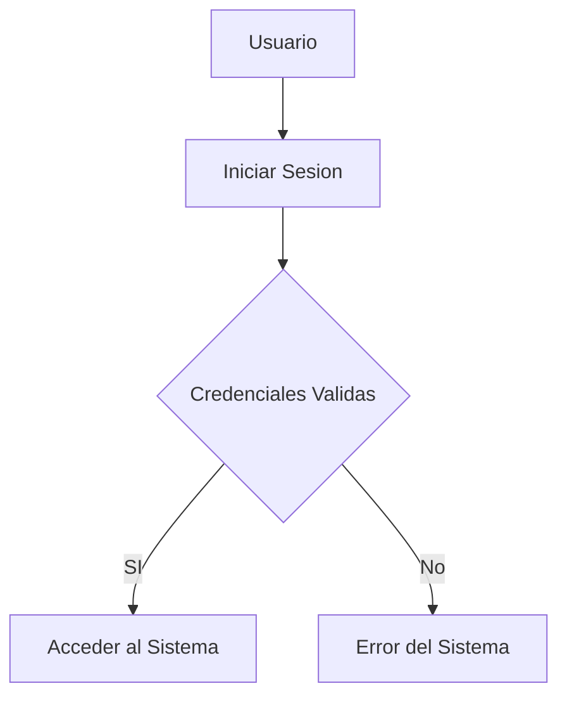

# indice
- [titulo](#titulo-importante)
- [Funciones](#funciones)
- [tecsup](#tecsup-diagrama)
- [tablas](#creando-tablas)
# titulo importante 
me encuentro aprendiendo *Markdown* en dos clases del profesor
Luis Pallin
## subtitulo 01
aqui verificamos con formatear diferentes **tipos de texto**
## subtitulo 02
podremos conocer diferentes tipos de formatos de textos
usando ~~markdown~~

### creando hiperv...
[Google](https://www.google.com)
[Tecsup](https://www.tecsup.edu.pe)

## colocar imagenes 


## funciones
- [x] registrar alumno
- [x] generar matricula
- [ ] campo vacio
- [ ] libre

## creando tablas
| lenguaje de programacion | Creador |
| -------------------------| --------|
| Java | James Cosling |
| PHP | Rasmus Lerdor |
| Pyhton | Guido Van Rossun |

## codigo
```html
<h1>Hola Mundo</h1>
```

```css
body{
    background: "red";
}
```

```java
public class Main{
    public static void main(String[] args){
        System.out.println("Hola Mundo Java");
    }
}
```

```java script
alert("Bienvenido a mi sitio web");
```

## mermaid diagramas


## tecsup diagrama
```mermaid
flowchart TD
A[Tecsup] --> B[Breve concepto]
B --> C[Mecanica]
B --> D[Informatica]
B --> E[Diseño]
B --> F[Dibujo]